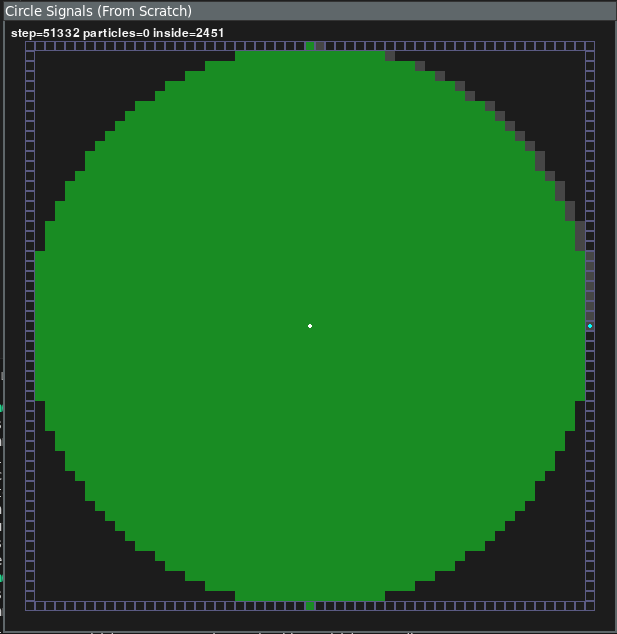

# circle_gen_cell_a

## Status
Active implementation is now a **from-scratch strict local-signal model** in:
- `src/circle_gen_cell_a/main.py`

The previous path-planned signal simulator (interesting but not strict local CA) was preserved in:
- `src/circle_gen_cell_a/signal_simulator.py`



## Archive truth (explicit)
- Original attempt date: **January 31, 2025** (`+0900` local timestamps).
- **None of the archived implementations worked.**
- They are kept only as history in `archive/`.

Paper references:
- `docs/paper.pdf`

## What the strict local implementation does
- Uses local neighbor-to-neighbor signal movement (no pre-planned full paths per token).
- Uses paper-style signal families (`j`, `k`, `j_bar`, `l1`, `l2`, `m`, `y`, `n`, `p`, `0`, copy signals).
- Includes Square(s) timing verification mode.
- Includes visual mode with decoupled simulation and rendering rates.

## Run
Sync environment:

```bash
uv sync
```

Square timing check:

```bash
uv run circle-gen --mode square-check --width 64 --max-i 20
```

Strict local circle run (headless):

```bash
uv run circle-gen --mode circle --width 51 --height 51
```

Strict local circle run (visual):

```bash
uv run circle-gen --mode circle --visual --width 51 --height 51 --cell-size 10
```

## Step rate vs render rate
In visual mode, simulation stepping and drawing are independent:

- `--step-rate`: simulation steps per second (`0` = unlimited)
- `--render-fps`: render frames per second (`0` = render every loop)

Example: 300 steps/sec + 60 FPS render:

```bash
uv run circle-gen --mode circle --visual --step-rate 300 --render-fps 60
```

Example: unlimited stepping + 60 FPS render:

```bash
uv run circle-gen --mode circle --visual --step-rate 0 --render-fps 60
```

## Future steps
- Explore **rule minimization**: discover smaller local rule sets / fewer signal types that still draw target shapes.
- Add a synthesis/search pipeline (SAT/SMT or evolutionary search) to learn local transition rules from target masks.
- Start with primitive shapes (circle, diamond, square), then compare:
  - number of states/signals
  - convergence steps
  - robustness across grid sizes
